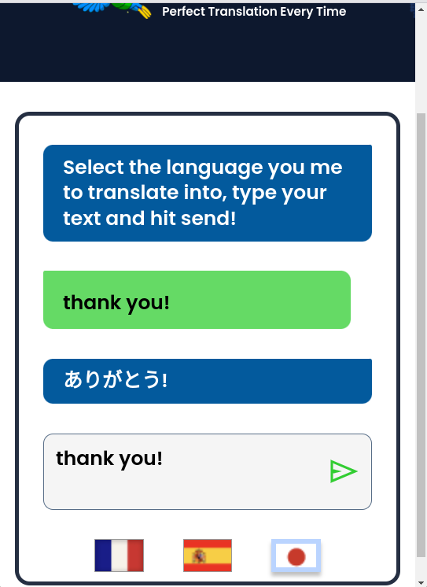

# 🌍 **PollyGlot — AI-Powered Language Translator**

Perfect translation. Smart moderation. Clean interface.


PollyGlot is a lightweight AI translation app that allows users to translate short text into multiple languages **instantly**.
It includes **built-in content moderation** to detect inappropriate, hateful, or harmful messages and display warnings — with a user-friendly override system.

---

## ✨ **Features**

### 🔤 **Accurate Translation**

Powered by OpenAI’s GPT model, PollyGlot provides fast and high-quality translations between:

* 🇫🇷 French
* 🇪🇸 Spanish
* 🇯🇵 Japanese

(You can easily extend this to more languages.)

---

### 🔍 **Smart Safety Moderation**

Before translating, the user’s text is scanned using **OpenAI’s Moderation API**.

It detects categories such as:

* Sexual
* Sexual/minors
* Harassment
* Hate
* Violence
* Self-harm

If the text is unsafe, the app shows:

> **“Blocked (category). Click to override.”**

Users can override the block **up to 3 times**.

---

### 💬 **Simple & Clean Chat UI**

* A message from the user
* A translated response from the AI
* Beautiful modern styling using CSS
* Flag buttons to select the output language

---

### ⚡️ Works Entirely in the Browser

Since Scrimba and browser environments cannot hide API keys, the project uses:

```js
new OpenAI({
  apiKey: "...",
  dangerouslyAllowBrowser: true
})
```

⚠️ **NEVER use a permanent or sensitive key in production.**
For demos (like Scrimba), always use a temporary key.

---

## 🛠️ **How It Works**

### 1️⃣ User selects a language

By clicking a flag button (French, Spanish, Japanese).

A `.select` CSS class marks the active language.

---

### 2️⃣ User enters a message

The input text is shown in the "human" message bubble.

---

### 3️⃣ Moderation check

Before translation, the app calls:

```js
openai.moderations.create({
    model: "omni-moderation-latest",
    input: msg
})
```

If any of the severe categories are true, the message is blocked.

The UI displays:

```
Blocked (category). Click to override.
```

The user may override **3 times maximum**.

---

### 4️⃣ Translation

If safe (or overridden), the app calls:

```js
openai.chat.completions.create({
    model: "gpt-3.5-turbo",
    messages: [
      { role: "system", content: translation_rules },
      { role: "user", content: `Translate in ${language}: "${msg}"` }
    ]
})
```

The model returns ONLY the translation.

---

### 5️⃣ Output is displayed

Translation replaces the AI bubble.

---

## 📁 **Project Structure**

```
/assets
    parrot.png
    worldmap.png
    fr-flag.png
    sp-flag.png
    jpn-flag.png

index.html
index.css
index.js
README.md
```

---

## 🎨 **Screenshots (Insert Your Images Here)**

| User Input                           | Translation Output                     |
| ------------------------------------ | -------------------------------------- |
|  |  |

(You can send me screenshots and I’ll embed them in perfect layout.)

---

## 🚀 **Getting Started**

### 1️⃣ Install dependencies

If you want to run this locally:

```bash
npm install openai
```

### 2️⃣ Add your API key

Inside `index.js`:

```js
const openai = new OpenAI({
    apiKey: "YOUR_KEY_HERE",
    dangerouslyAllowBrowser: true
});
```

⚠️ Only use temporary keys in browser environments.

---

## 🔐 **Security Warning**

Because API keys are visible in browser JavaScript:

* Do NOT deploy this version publicly.
* Anyone can inspect the key in DevTools.
* Use only for learning, demos, or Scrimba exercises.

For production, I can help you add a **secure backend proxy**.

---

## 🧠 **Future Enhancements**

* Add more languages
* Add speech-to-text
* Add dark mode
* Add history of translations
* Add rate-limit indicator
* Replace GPT-3.5 with GPT-4o mini for faster + better translations

---

## ❤️ Built With Love

Created to learn and showcase:

* OpenAI API usage
* Moderation pipelines
* Clean UI design
* Browser-based AI apps

